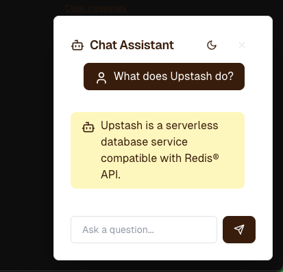

# Upstash RAG Chat Widget

A customizable React chat widget built on top of the [@upstash/rag-chat SDK](), providing an out-of-the-box solution for adding RAG-powered chat interfaces to your applications.

<table>
  <tr>
    <td align="center">
      <br/>
      <em>Closed State</em>
    </td>
    <td align="center">
      <br/>
      <em>Open State</em>
    </td>
  </tr>
</table>

## Features

🎨 Fully customizable UI components
⚡ Streaming responses support
📱 Responsive design
🔍 Real-time context retrieval
💾 Persistent chat history
🎯 Built-in rate limiting support
🔄 Loading states and error handling
🎨 Dark/light mode support

## Installation

```bash
# Using npm
npm install @upstash/rag-chat-widget

# Using pnpm
pnpm add @upstash/rag-chat-widget

# Using yarn
yarn add @upstash/rag-chat-widget
```

## Quick Start

### 1. Environment Variables

Set up the environment variables below from your Upstash resources. If you don't have any, you can start by going to [Upstash Console](https://console.upstash.com)

### 2. Configure Styles

In your `tailwind.config.ts` file, add the configuration below:

```ts
import type { Config } from "tailwindcss";

export default {
  content: ["./node_modules/@upstash/ragchat-widget/**/*.css"],
} satisfies Config;
```

### 3. Implementation

```jsx
import { ChatWidget } from "ragchat-widget";

const Component = () => {
  return <ChatWidget />;
};
```

## Adding Content
