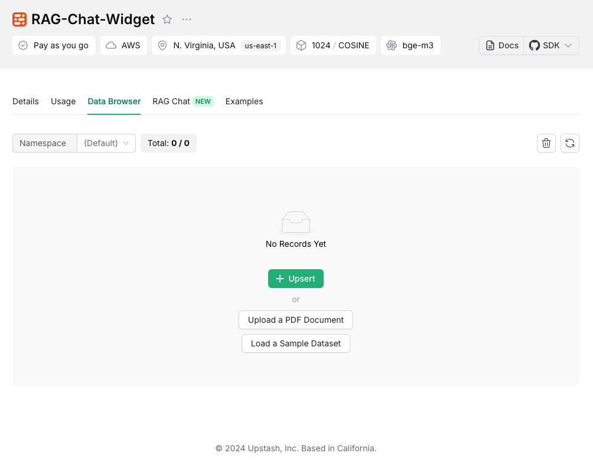

# RAG Chat Component

A customizable Reach chat component that combines Upstash Vector for similarity search, Together AI for LLM, and Vercel AI SDK for streaming responses. This ready-to-use component provides an out of the box solution for adding RAG-Powered chat interfaces to your Next.js application.

<table>
  <tr>
    <td align="center">
      <br/>
      <em>Closed State</em>
    </td>
    <td align="center">
      <br/>
      <em>Open State</em>
    </td>
  </tr>
</table>

## Features

⚡ Streaming responses support

💻 Server actions

📱 Responsive design

🔍 Real-time context retrieval

💾 Persistent chat history

🎨 Fully customizable UI components

🎨 Dark/light mode support

## Installation

```bash
# Using npm
npm install @upstash/rag-chat-component

# Using pnpm
pnpm add @upstash/rag-chat-component

# Using yarn
yarn add @upstash/rag-chat-component
```

## Quick Start

### 1. Environment Variables

Create an Upstash Vector database and set up the environment variables as below. If you don't have an account, you can start by going to [Upstash Console](https://console.upstash.com).

Choose an embedding model when creating an index in Upstash Vector.

```
UPSTASH_VECTOR_REST_URL=
UPSTASH_VECTOR_REST_TOKEN=

# Optional for persistent chat history
UPSTASH_REDIS_REST_URL=
UPSTASH_REDIS_REST_TOKEN=

OPENAI_API_KEY=

TOGETHER_API_KEY=

# Optional
TOGETHER_MODEL=
```

### 2. Configure Styles

In your `tailwind.config.ts` file, add the configuration below:

```ts
import type { Config } from "tailwindcss";

export default {
  content: ["./node_modules/@upstash/rag-chat-component/**/*.{js,mjs}"],
} satisfies Config;
```

### 3. Implementation

The RAG Chat Component can be integrated into your application using two straightforward approaches. Choose the method that best fits your project structure:

#### 1. Using a Dedicated Component File (Recommended)

Create a seperate component file with the `use client` directive, then import and use it anywhere in your application.

```jsx
// components/chat.tsx
"use client";

import { ChatComponent } from "@upstash/rag-chat-component";

export const Chat = () => {
  return <ChatComponent />;
};
```

```jsx
// page.tsx
import { Chat } from "./components/chat";

export default function Home() {
  return (
    <>
      <Chat />
      <p>Home</p>
    </>
  );
}
```

#### 2. Direct Integration in Client Components

Alternatively, import and use the **ChatComponent** directly in your client-side pages.

```jsx
// page.tsx
"use client";
import { ChatComponent } from "@upstash/rag-chat-component";

export default function Home() {
  return (
    <>
      <ChatComponent />
      <p>Home</p>
    </>
  );
}
```

### 4. Choosing Chat Model

It's possible to choose one of the [together.ai](https://www.together.ai/) models for the chat.
Default model is `meta-llama/Meta-Llama-3.1-8B-Instruct-Turbo`. You can configure it in the environment variables.

```
TOGETHER_MODEL="deepseek-ai/DeepSeek-V3"
```

### 5. Additional Notes

If you're deploying on Vercel and experiencing timeout issues, you can increase the function execution time limit by adding the following configuration to your `vercel.json`:

```
{
  "functions": {
    "app/**/*": {
      "maxDuration": 30
    }
  }
}
```

This extends the function timeout to 30 seconds, allowing more time for RAG operations to complete on serverless functions.

</details>

## Adding Content

You can add content to your RAG Chat component in several ways:

<details>
<summary>1. Using Upstash Vector SDK</summary>

Upstash has Vector SDKs in JS and Python. You can use those SDK to insert data to your Vector index.

[Vector JS SDK](https://github.com/upstash/vector-js)

[Vector Python SDK](https://github.com/upstash/vector-py)

For other languages you can use [Vector REST API](https://upstash.com/docs/vector/api/get-started).

</details>

<details>
<summary>2. Using Upstash Vector UI</summary>

For testing purpose, you can add your data directly through the Upstash Vector Console:

1. Navigate to [Upstash Console](http://console.upstash.com/vector).
2. Go to details page of the Vector database.
3. Navigate to **Data Browser Tab**.
4. Here, you can upsert data or upload a PDF.

<br/>

</details>

<details>
<summary>3. docs2vector tool</summary>

If you are planning to insert your documentation (markdown files) to your Vector index, then you can use [docs2vector](https://github.com/upstash/docs2vector/) tool.

</details>

## Development

You can use the playground for development, by basically running the command in the root.

```bash
bun run playground
```

## Roadmap

- Integration with [QStash](https://upstash.com/docs/qstash/overall/getstarted) for infinite timout for serverless functions

## Contributing

We welcome contributions! Please see our contributing guidelines for more details.

## License

MIT License - see the LICENSE file for details.
